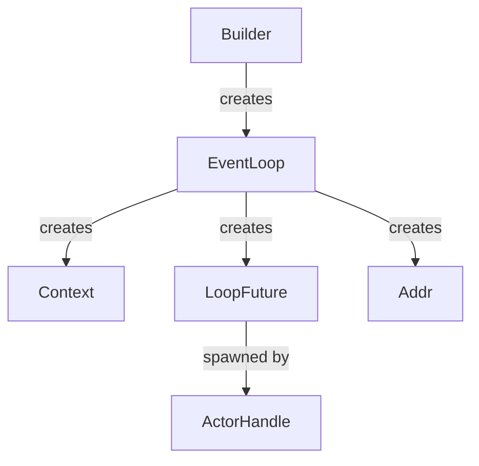
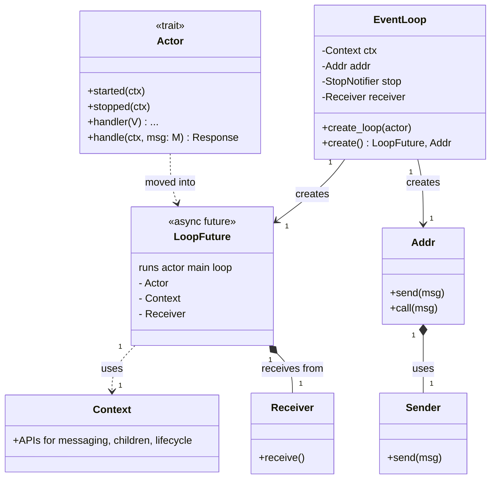

# How do actors work?

An actor framework allows you to turn ordinary rust types into Actors.
An actor is an object with a lifecycle and a set of handlers for incoming messages.

You communicate with actors by sending messages to their addresses.
This allows you to build complex systems with asynchronous communication and parallel processing.

## Central Entities

### `Actor`

- Used via addr, sender, or caller.
- Handles messages through the handler trait.
- Defines lifecycle hooks such as `started` and `stopped`.
- Lifecycle hooks are called automatically when the actor starts or stops.
- You can override these hooks to perform initialization or cleanup logic.

### `Channel`

- Every running actor instance has one channel.
- All communication with this actor goes through this channel.

### `Context`

- Created along with the event loop.
- Provides APIs for messaging, children, and lifecycle.
- Available in lifecycle and handler methods (`started`, `stopped`, `handle`).

### `Addr<A>`

- Used to send messages to a specific Actor type.
- Holds a strong reference to channel's sender.

### `EventLoop`s

- Owns the channel's receiver.
- Loops on the channel's receiver.
- Takes ownership of the actor.
- Creates a loop future (spawned elsewhere).

### `Payload`

- Internal enum wrapping all messages and control signals sent to actors.
- All communication to an actor is packaged as a payload and sent via its channel.
- The event loop matches on payload to dispatch messages, stop, or restart the actor.
- Enables unified handling of user messages and system events.

### ActorHandle

- Awaits the loop future into a task.

<table>
<tr>
<th> Runtime creation </th>
<th> Central Entities</th>
</tr>
<tr>
<td>

</td>
<td>

</td>
</tr>
</table>

## Additional Entities

### `Sender` / `Caller`

- Used to send messages to an actor.
- Unlike `Addr<A>` the `Sender<M>` refers to the Message and not the a concrete actor. Therefore a `Sender<M>` may refer to any type of Actor that implements `Handler<M>`.

### `WeakAddr`

- Holds a weak reference to channel's sender.

### `OwningAddr`

- Holds a strong reference to channel's sender.
- Owns the event loop future and can therefore be awaited to receive the original actor object back after it terminated.
